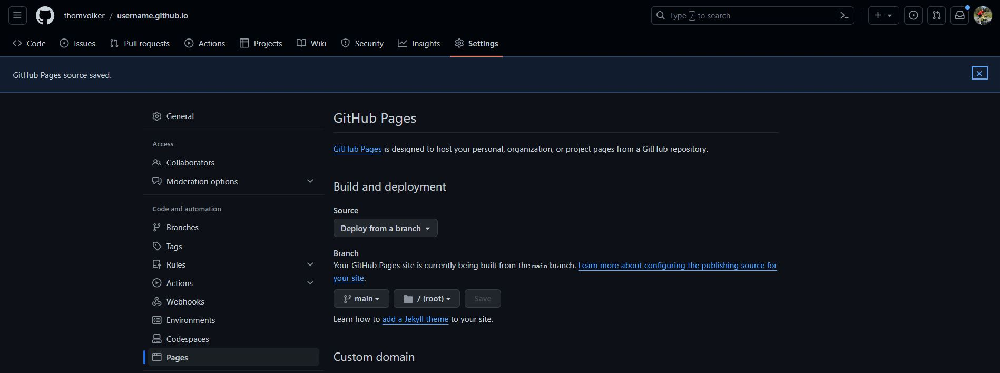

# Howto: Create a Hugo website and host it via GitHub pages
Thom Benjamin Volker

# Disclaimer

Almost all material from this document is obtained and/or adapted from
the [Hugo website](https://gohugo.io). If you want more information
about any of the steps involved, go check the tutorial
[here](https://gohugo.io/hosting-and-deployment/hosting-on-github/).

# Prerequisites

1.  Create a GitHub account
2.  Install Git

# Install Hugo

To install Hugo on Windows, it is easiest to first install a package
manager. For our purposes, the Windows Package Manager works fine.

## Installing Hugo on Windows

**1. Install Windows Package Manager from
[here](https://apps.microsoft.com/detail/9NBLGGH4NNS1?rtc=1&hl=nl-nl&gl=NL#activetab=pivot:overviewtab).**

------------------------------------------------------------------------

**2. Install Hugo as follows.**

------------------------------------------------------------------------

In the terminal, run:

    winget install Hugo.Hugo.Extended

## Install Hugo on MacOS

On MacOS devices, you’ll also need a package manager. In my experience,
[Homebrew](https://brew.sh/) works quite well.

------------------------------------------------------------------------

**1. Install `Homebrew` as follows.**

------------------------------------------------------------------------

In your terminal, run the following code.

    /bin/bash -c "$(curl -fsSL https://raw.githubusercontent.com/Homebrew/install/HEAD/install.sh)"

------------------------------------------------------------------------

**2. Install Hugo as follows.**

------------------------------------------------------------------------

In your terminal, run:

    brew install hugo

# Create your own website

To create your own website, choose a template that you like from
<https://themes.gohugo.io/>.

For illustration purposes, I pick the `KeepIt`-theme, which is a simple,
yet quite advanced, blog theme for Hugo. Among others, it supports
mathematical formulae and extended markdown syntax.

------------------------------------------------------------------------

**1. Verify that you have installed Hugo v0.112.0 or later.**

------------------------------------------------------------------------

    hugo version

On my machine, this returns

    hugo v0.122.0-b9a03bd59d5f71a529acb3e33f995e0ef332b3aa+extended windows/amd64 BuildDate=2024-01-26T15:54:24Z VendorInfo=gohugoio

------------------------------------------------------------------------

**2. On GitHub, create a repository that you call
`username.github.io`.**

------------------------------------------------------------------------

**3. In the terminal, set the path to the location where you want to
store your personal webpage.**

------------------------------------------------------------------------

Run the following code in the terminal, and make sure to adapt the
`path/to/library` to the path where you actually want to store your
webpage.

    cd path/to/directory

------------------------------------------------------------------------

**4. Clone the empty git repository from GitHub.**

------------------------------------------------------------------------

    git clone https://github.com/username/username.github.io.git

------------------------------------------------------------------------

**5. Set `username.github.io` as the current directory.**

------------------------------------------------------------------------

    cd username.github.io

**6. Create the local directory structure for your project in the
`username.github.io` directory.**

------------------------------------------------------------------------

To do this, run the following line of code. Note that this creates a
folder in your local directory containing the structure for the website.


    hugo new site . --force

------------------------------------------------------------------------

**7. Clone the `Hugo` theme of your liking into the `themes` directory
(this is already part of the folder structure that you’ve set up
previously), and add it to the project as a Git Submodule.**

------------------------------------------------------------------------

Note that you have to find the `.git` repository where the theme is
located. Typically, the `Hugo` themes include a short guide on how to do
it. In case of the `KeepIt` theme, there is no description, but it is as
simple as running the following line of code in the terminal.

    git submodule add https://github.com/Fastbyte01/KeepIt.git themes/KeepIt

**DO NOT CLOSE THE TERMINAL AFTER THIS STEP**

Make sure that you change the `GitHub` repository to the theme you want
to use, and to change `themes/KeepIt` to `themes/YourTheme` to the name
of the theme that you want to use.

------------------------------------------------------------------------

**8. Open the file `hugo.toml` in some text editor (this can be
`notepad`, but also `VSCode`, whatever you find easy).**

------------------------------------------------------------------------

**9. In the `hugo.toml` file, append the following line below the
current content of the file, and save the file.**

------------------------------------------------------------------------

    theme = 'KeepIt'

Or, if you chose another theme, change it to the name of your theme.
Note that this has to correspond with the name you gave to the folder of
the theme in **7.**

------------------------------------------------------------------------

**10. Go to the terminal, and in the terminal run the following line of
code.**

------------------------------------------------------------------------

    hugo server

This gives the following output:

    Watching for changes in C:\Users\5868777\surfdrive\Documents\username.github.io\{archetypes,assets,content,data,i18n,layouts,static,themes}
    Watching for config changes in C:\Users\5868777\surfdrive\Documents\username.github.io\hugo.toml, C:\Users\5868777\surfdrive\Documents\username.github.io\themes\KeepIt\config.toml
    Start building sites …
    hugo v0.122.0-b9a03bd59d5f71a529acb3e33f995e0ef332b3aa+extended windows/amd64 BuildDate=2024-01-26T15:54:24Z VendorInfo=gohugoio

    WARN  Current environment is "development". The "comment system", "CDN" and "fingerprint" will be disabled.
    当前运行环境是 "development". "评论系统", "CDN" 和 "fingerprint" 不会启用.
    WARN  The "tweet" shortcode will soon require two named parameters: user and id. See "C:\Users\5868777\surfdrive\Documents\username.github.io\themes\KeepIt\content\posts\theme-documentation-built-in-shortcodes\index.en.md:151:1"

                       | EN
    -------------------+-----
      Pages            | 40
      Paginator pages  |  0
      Non-page files   | 19
      Static files     | 73
      Processed images |  0
      Aliases          | 11
      Sitemaps         |  1
      Cleaned          |  0

    Built in 476 ms
    Environment: "development"
    Serving pages from memory
    Running in Fast Render Mode. For full rebuilds on change: hugo server --disableFastRender
    Web Server is available at http://localhost:1313/ (bind address 127.0.0.1)
    Press Ctrl+C to stop

We can now preview our site at `http://localhost:1313/` (simply insert
this as the address in your webbrowser).

------------------------------------------------------------------------

<!-- __11. We will now create the actual website (keeping all default documents, we will change these later on).__ -->
<!-- --- -->
<!-- Run the following line in the terminal: -->
<!-- ``` -->
<!-- hugo -->
<!-- ``` -->
<!-- We have now created a new folder, called `/public/`, in which all `.html` files to render the webpage on GitHub will be stored. -->

**11. Commit all changes and push to GitHub (this can be done in
multiple ways, easiest is using the command line interface or a
programme like GitHub desktop).**

------------------------------------------------------------------------

In principle, running the following lines in the terminal will do.

    git add .
    git commit -m "Initialize website repository"
    git push

------------------------------------------------------------------------

**12. Go to the GitHub repository online, which should be under your
account \> Repositories. Then, go to the “Settings”-pane, and click on
“Pages” on the left menu.**

------------------------------------------------------------------------



------------------------------------------------------------------------

**13. Change the “Source”-option from “Deploy from a branch” to “GitHub
Actions”.**

------------------------------------------------------------------------

**14. In your local repository, create a new folder called “.github”.
Within this folder, create another folder called “workflows”. Within
this folder, create a new file called “hugo.yaml” (and make sure that it
has the .yaml extension).**

------------------------------------------------------------------------

**15. Add the following content to the empty file `hugo.yaml`.**

------------------------------------------------------------------------

    # Sample workflow for building and deploying a Hugo site to GitHub Pages
    name: Deploy Hugo site to Pages

    on:
      # Runs on pushes targeting the default branch
      push:
        branches:
          - main

      # Allows you to run this workflow manually from the Actions tab
      workflow_dispatch:

    # Sets permissions of the GITHUB_TOKEN to allow deployment to GitHub Pages
    permissions:
      contents: read
      pages: write
      id-token: write

    # Allow only one concurrent deployment, skipping runs queued between the run in-progress and latest queued.
    # However, do NOT cancel in-progress runs as we want to allow these production deployments to complete.
    concurrency:
      group: "pages"
      cancel-in-progress: false

    # Default to bash
    defaults:
      run:
        shell: bash

    jobs:
      # Build job
      build:
        runs-on: ubuntu-latest
        env:
          HUGO_VERSION: 0.122.0
        steps:
          - name: Install Hugo CLI
            run: |
              wget -O ${{ runner.temp }}/hugo.deb https://github.com/gohugoio/hugo/releases/download/v${HUGO_VERSION}/hugo_extended_${HUGO_VERSION}_linux-amd64.deb \
              && sudo dpkg -i ${{ runner.temp }}/hugo.deb          
          - name: Install Dart Sass
            run: sudo snap install dart-sass
          - name: Checkout
            uses: actions/checkout@v4
            with:
              submodules: recursive
              fetch-depth: 0
          - name: Setup Pages
            id: pages
            uses: actions/configure-pages@v4
          - name: Install Node.js dependencies
            run: "[[ -f package-lock.json || -f npm-shrinkwrap.json ]] && npm ci || true"
          - name: Build with Hugo
            env:
              # For maximum backward compatibility with Hugo modules
              HUGO_ENVIRONMENT: production
              HUGO_ENV: production
            run: |
              hugo \
                --gc \
                --minify \
                --baseURL "${{ steps.pages.outputs.base_url }}/"          
          - name: Upload artifact
            uses: actions/upload-pages-artifact@v2
            with:
              path: ./public

      # Deployment job
      deploy:
        environment:
          name: github-pages
          url: ${{ steps.deployment.outputs.page_url }}
        runs-on: ubuntu-latest
        needs: build
        steps:
          - name: Deploy to GitHub Pages
            id: deployment
            uses: actions/deploy-pages@v3

------------------------------------------------------------------------

**16. Again commit the changes and push to github.**

------------------------------------------------------------------------

    git add .
    git commit -m "Add workflow"
    git push

As soon as GitHub Actions has finished, you should be able to view your
site at `username.github.io`. It is not difficult to use a different
domain name (e.g., `username.com`, or something else entirely).
